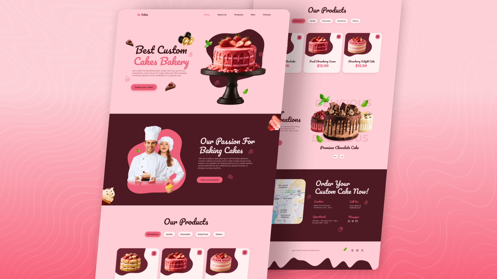

# 🍰 Sugar Rush

> Responsive cake bakery website built following **Bedimcode**'s tutorial.  
> Vanilla HTML/CSS/JS, 3 Swiper sliders, ScrollReveal animations, mobile-first navigation.  
> Sweet code, sweeter design.

<p align="center">
  
  
  
  
  
</p>

---

## 📸 Preview

<p align="center">
  
</p>

<!--
<p align="center">
  
  
</p>
-->

---

## ✨ Features

- **Fully Responsive** — mobile-first, modern range syntax: `<=360px`, `>=540px`, `>=768px`, `<=1150px`, `>=1150px`, `>=2048px` (2K via `zoom: 120%`)
- **3 Swiper Sliders** — home hero (creative effect + autoplay 3s), products (tabs + thumbs sync), new arrivals (creative + arrows + autoplay)
- **ScrollReveal Animations** — `origin: bottom, distance: 60px, duration: 1500`, per-section reveals (`main.js` → `sr.reveal`)
- **Scroll-Up Button** — appears after 350px of scroll
- **Active Nav Links** — menu item highlights as you scroll through sections
- **Mobile Hamburger Menu** — slide-in panel, auto-closes on link click
- **Contact + Map** — order section with embedded Google Maps
- **Full Footer** — links, socials, blob decor
- **CSS Custom Properties** — full theme in `:root` (`styles.css`), type scale grows at `>=1150px`
- **Vanilla Stack** — zero frameworks, no build step

---

## 🍰 Sections & Content

| Section | Anchor | What's inside (`index.html`) |
|---------|--------|------------------------------|
| Home | `#home` | Hero title, description, order CTA, cake carousel (4 cakes) |
| About | `#about` | Passion-for-baking story, cupcakes, photo |
| Products | `#product` | 5 tab categories × 3 cakes: Strawberry, Vanilla, Chocolate, Dried fruit, Others |
| New | `#new` | New creations slider with arrows (5 cakes) |
| Contact | `#contact` | Order CTA, address/phones, WhatsApp/Messenger links, map embed |

Plus: slide-in header nav, footer, scroll-up button.

---

## 🛠 Tech Stack

| Technology | Version / Details | Where |
|------------|-------------------|-------|
| HTML5 | Semantic markup | `index.html` |
| CSS3 | Custom properties, Grid, Flexbox, animations | `assets/css/styles.css` |
| JavaScript (ES6+) | DOM, Swipers, ScrollReveal, menu/scroll logic | `assets/js/main.js` |
| [Swiper](https://swiperjs.com/) | 12 via jsDelivr | `home__swiper`, `product__tabs` + `product__content`, `new__swiper` |
| [ScrollReveal](https://scrollrevealjs.org/) | 4.0.9 via cdnjs | `sr = ScrollReveal({...})` in `main.js` |
| [Remixicon](https://remixicon.com/) | 4.9.0 via jsDelivr | Menu, contact, footer, scroll-up icons |
| [Google Fonts](https://fonts.google.com/) | Montserrat + Pacifico, via `@import` in CSS | `--body-font`, `--second-font` |

---

## 🚀 Quick Start

```bash
# Clone the repo
git clone https://github.com/h1chan/Sugar-Rush.git
cd Sugar-Rush

# Open index.html in browser
# (or run Live Server in VS Code)
```

No `npm install`, `build`, or dependencies — pure frontend.

---

## 📁 Project Structure

```
Sugar-Rush/
├── index.html           # Entry point (Home · About · Products · New · Contact)
├── assets/
│   ├── css/
│   │   └── styles.css   # All styles (~1260 lines)
│   ├── js/
│   │   └── main.js      # Menu, sliders, reveal, scroll (~180 lines)
│   └── img/             # Cakes (home/products/new), blobs, stickers, leaves, logo
└── README.md
```

---

## 🎨 Customization

| What to change | Where to look |
|----------------|---------------|
| Brand colors | `:root` in `styles.css` (`--first-color`, `--second-color`, `--body-color`...) |
| Fonts | `@import` at top of `styles.css` + `--body-font`, `--second-font` |
| Cakes & prices | `index.html` → `product__card` blocks |
| Hero slider | `main.js` → `home__swiper` (effect, `speed`, `autoplay.delay`) |
| Products tabs | `main.js` → `swiperTabs` + `swiperProducts` (thumbs sync) |
| New arrivals slider | `main.js` → `new__swiper` (navigation arrows, autoplay) |
| Scroll animations | `main.js` → `ScrollReveal({...})` + `sr.reveal(...)` per section |
| Scroll-up trigger | `main.js` → `scrollUp` (`scrollY >= 350`) |
| Header shadow trigger | `main.js` → `scrollHeader` (`scrollY >= 50`) |
| Map location | `index.html` → contact `<iframe>` embed URL |

---

## 📱 Responsive Breakpoints

```css
/* Mobile First, range syntax → */
@media (width <= 360px)  { /* Small phones */ }
@media (width >= 540px)  { /* Grids lock to 400px centered columns */ }
@media (width >= 768px)  { /* Products go 2-column, footer blob grows */ }
@media (width <= 1150px) { /* Tablet / mobile slide-in menu */ }
@media (width >= 1150px) { /* Desktop layout + larger type scale */ }
@media (width >= 2048px) { /* 2K: body zoom 120% */ }
```

---

## 🙏 Credits

Built following [Bedimcode](https://www.youtube.com/@Bedimcode)'s  
**"Responsive Cake Website"** tutorial on YouTube.

🎬 [Watch the Demo & Code](https://youtu.be/G6q7AkaljE4?si=rUHEO1V4YMFMVI60)

Original design & tutorial by Bedimcode — thank you for the amazing content!

---

## 📄 License

[MIT License](LICENSE) — free to use, modify, distribute.  
Keep a copy of the license when forking.

---

## 👤 Author

h1chan — [GitHub](https://github.com/h1chan) · [Discord](https://discord.com/users/1064052965247295518)

---

<p align="center">
  Made with 🍰 and vanilla JS
</p>
